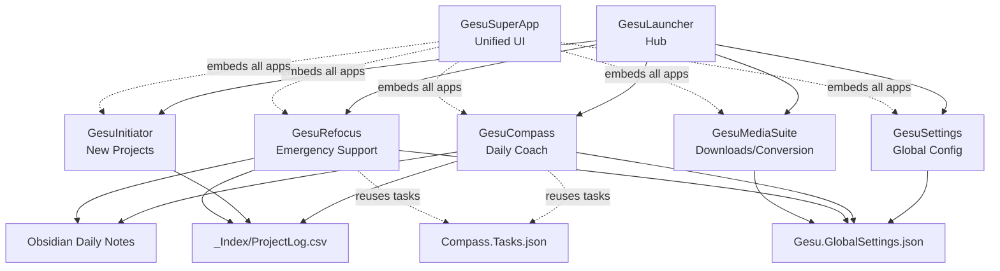

# Current State: Gesu Ecosystem PowerShell + WPF Stack

## Overview

The Gesu Ecosystem v1 is a comprehensive personal productivity and project management system built entirely with PowerShell scripts and WPF-based GUIs. It provides an integrated suite of tools for managing workflows, projects, focus sessions, media processing, and personal well-being.

**Architecture**: CLI-first with optional WPF GUI wrappers  
**Language**: PowerShell  
**UI Framework**: WPF (XAML-based desktop interfaces)  
**Configuration**: JSON-based settings system  
**Backup Location**: `D:\03. Resources\_Gesu's\Backup\WorkFlowDatabase-ps-stack-v1`

---

## Folder Structure

```
WorkFlowDatabase/
├── _Apps/              # All application modules
├── _Core/              # Shared modules and configurations
│   ├── Modules/        # Reusable PowerShell modules
│   ├── SharedConfigs/  # Global theme and configuration files
│   └── SharedLibs/     # (if any) Shared libraries
├── _Docs/              # Documentation
├── _Index/             # Centralized logs and indexes (e.g., ProjectLog.csv)
├── _Templates/         # Project and file templates
├── _Archive/           # Archived projects or data
├── _Sandbox/           # Experimental/test area
├── Tools/              # External tools (yt-dlp, ffmpeg, ImageMagick, etc.)
└── .git/               # Git version control
```

---

## Core Applications

The ecosystem consists of **7 main applications**, each with both CLI and GUI versions:

### 1. **GesuLauncher** 
**Purpose**: Central hub / front door to the ecosystem  
**Files**:
- [GesuLauncher.ps1](file:///D:/03.%20Resources/_Gesu's/WorkFlowDatabase/_backup-reference/_Apps/GesuLauncher/bin/GesuLauncher.ps1) - CLI menu
- [GesuLauncherGUI.ps1](file:///D:/03.%20Resources/_Gesu's/WorkFlowDatabase/_backup-reference/_Apps/GesuLauncher/bin/GesuLauncherGUI.ps1) - WPF GUI

**Responsibilities**:
- Display current date/time and WorkflowRoot
- Show last active project from `ProjectLog.csv`
- Launch other apps in new PowerShell windows
- Provide quick navigation to all ecosystem tools

**Key Features**:
- Auto-detects `WorkflowRoot` from script location
- Reads project info from GesuInitiator logs
- Simple menu-driven CLI interface

---

### 2. **GesuCompass**
**Purpose**: Daily coach and focus session manager  
**Files**:
- [GesuCompass.ps1](file:///D:/03.%20Resources/_Gesu's/WorkFlowDatabase/_backup-reference/_Apps/GesuCompass/bin/GesuCompass.ps1) - CLI version (~1000 lines)
- [GesuCompassGUI.ps1](file:///D:/03.%20Resources/_Gesu's/WorkFlowDatabase/_backup-reference/_Apps/GesuCompass/bin/GesuCompassGUI.ps1) - WPF GUI

**Responsibilities**:
- **Morning routine**: Energy assessment (0-10 scale)
- **Mode selection**: Recovery / Normal / Push (based on energy)
- **Daily tasks**: Random micro-tasks from 6 life areas
  - `money` - Financial tasks
  - `creative` - Design/archviz work
  - `relations` - Social connections
  - `learning` - Skill development
  - `content` - Content creation
  - `selfcare` - Health and wellness
- **Focus sessions**: Pomodoro-style work tracking with project integration
- **Weekly analytics**: Track energy, accuracy, and focus patterns

**Data Files**:
- `Compass.Today.json` - Current day data
- `Compass.History.jsonl` - Historical daily records
- `Compass.Settings.json` - App settings
- `Compass.Tasks.json` - Task pool configuration

**Integration**:
- Writes to Obsidian Daily Notes
- Integrates with Notion calendar (via Windows app paths)
- Reads project info from GesuInitiator logs

---

### 3. **GesuRefocus**
**Purpose**: Emergency "lost/overwhelmed" questionnaire and recovery tool  
**Files**:
- [GesuRefocus.ps1](file:///D:/03.%20Resources/_Gesu's/WorkFlowDatabase/_backup-reference/_Apps/GesuRefocus/bin/GesuRefocus.ps1) - CLI version (~465 lines)
- [GesuRefocusGUI.ps1](file:///D:/03.%20Resources/_Gesu's/WorkFlowDatabase/_backup-reference/_Apps/GesuRefocus/bin/GesuRefocusGUI.ps1) - WPF GUI

**Responsibilities**:
- Quick check-in when feeling lost or dropping energy
- **4-question assessment**:
  1. Current feeling (text)
  2. Overwhelm level (0-10)
  3. Basic needs check (Y/N)
  4. Self-harm thoughts screening (Y/N - with crisis resources)
- **Recovery options**:
  1. Self-care micro-task
  2. 10-min productive task
  3. Contact someone
  4. Just acknowledge the moment
- Logs to Obsidian Daily Notes
- Pulls random tasks from GesuCompass task pools

---

### 4. **GesuMediaSuite**
**Purpose**: Media downloader and converter (YouTube, audio/video processing)  
**Files**:
- [GesuMediaSuite.ps1](file:///D:/03.%20Resources/_Gesu's/WorkFlowDatabase/_backup-reference/_Apps/GesuMediaSuite/bin/GesuMediaSuite.ps1) - CLI version (~3000 lines!)
- [GesuMediaSuiteGUI.ps1](file:///D:/03.%20Resources/_Gesu's/WorkFlowDatabase/_backup-reference/_Apps/GesuMediaSuite/bin/GesuMediaSuiteGUI.ps1) - WPF GUI

**Responsibilities**:
- **Download presets**:
  - Music MP3 (audio-only)
  - Referensi Editing (720p for editing reference)
  - Wedding Visual (1080p best quality for client work)
  - Best Video (maximum quality, no limit)
- **Local conversion**:
  - Audio → MP3
  - Video → Proxy 720p
- **Network profiles**: Hemat / Normal / Gaspol (bandwidth throttling)
- **Batch processing**: Multi-URL support, playlist support, `.txt` file lists
- **Tool integration**: yt-dlp, ffmpeg, ImageMagick, LibreOffice (soffice)

**Configuration**:
- `MediaSuite.Settings.json` - Paths, network profiles, tool locations
- `MediaSuite.Presets.json` - Download and conversion presets
- `Paths.Settings.json` - Output folder structure

**Logging**:
- `GesuMediaDownloader_Log.csv` - Download history with URLs, formats, file sizes

---

### 5. **GesuInitiator**
**Purpose**: New project initialization and setup  
**Files**:
- [GesuInitiator.ps1](file:///D:/03.%20Resources/_Gesu's/WorkFlowDatabase/_backup-reference/_Apps/GesuInitiator/bin/GesuInitiator.ps1)
- [GesuInitiatorGUI.ps1](file:///D:/03.%20Resources/_Gesu's/WorkFlowDatabase/_backup-reference/_Apps/GesuInitiator/bin/GesuInitiatorGUI.ps1)

**Responsibilities**:
- Create new project folders with templates
- Generate unique project codes
- Set up project structure (likely from `_Templates`)
- Log projects to `ProjectLog.csv`

**Data Files**:
- `logs/ProjectLog.csv` - Central project registry
- `Initiator.Settings.json` - Project templates and defaults

---

### 6. **GesuSettings**
**Purpose**: Global configuration manager and ecosystem health checker  
**Files**:
- [GesuSettings.ps1](file:///D:/03.%20Resources/_Gesu's/WorkFlowDatabase/_backup-reference/_Apps/GesuSettings/bin/GesuSettings.ps1)
- [GesuSettingsGUI.ps1](file:///D:/03.%20Resources/_Gesu's/WorkFlowDatabase/_backup-reference/_Apps/GesuSettings/bin/GesuSettingsGUI.ps1)

**Responsibilities**:
- Manage `Gesu.GlobalSettings.json`
- Sync settings across all apps
- Health check for ecosystem integrity
- Path configuration for external apps (Notion, Obsidian, project root)

**Configuration**:
- Each app has a copy of `Gesu.GlobalSettings.json` in its `config/` folder
- Settings likely propagate from GesuSettings to other apps

---

### 7. **GesuSuperApp**
**Purpose**: All-in-one integrated interface (experimental)  
**Files**:
- [GesuEcosystemGUI.ps1](file:///D:/03.%20Resources/_Gesu's/WorkFlowDatabase/_backup-reference/_Apps/GesuSuperApp/bin/GesuEcosystemGUI.ps1)
- Module wrappers for each app:
  - `modules/Module.Compass.ps1`
  - `modules/Module.Initiator.ps1`
  - `modules/Module.MediaSuite.ps1`
  - `modules/Module.Refocus.ps1`
  - `modules/Module.Settings.ps1`

**Responsibilities**:
- Single WPF window with tabs for each app
- Modular architecture - each app embedded as a module
- Unified navigation experience

---

## Shared Infrastructure

### **_Core/Modules/**

Two main PowerShell modules provide shared functionality:

1. **Gesu.Core.psm1**  
   - Core business logic shared across apps
   - Path resolution helpers
   - Common data structures

2. **Gesu.PSUtils.psm1**  
   - PowerShell utility functions
   - File I/O helpers
   - JSON parsing and validation

### **Global Configuration**

**`Gesu.GlobalSettings.json`** (found in each app's `config/` folder):

```json
{
  "NotionMainExe": "C:\\Users\\Surya\\AppData\\Local\\Programs\\cron-web\\Notion Calendar.exe",
  "ProjectRoot": "D:\\01. Projects",
  "DefaultFocusMinutes": 15
}
```

**Additional configs**:
- `Theme.Settings.json` in `_Core/SharedConfigs/` - UI theming for WPF apps

---

## App Interaction Patterns



### **Data Flow**

1. **Project tracking**: GesuInitiator creates projects → logs to `ProjectLog.csv` → GesuLauncher and GesuCompass read current project
2. **Task definitions**: GesuCompass defines task pools → GesuRefocus reuses them for recovery suggestions
3. **Settings propagation**: GesuSettings manages global config → syncs to all apps' `config/` folders
4. **Daily notes**: GesuCompass and GesuRefocus both append check-ins to Obsidian markdown files

---

## Technology Stack

| Component | Technology |
|-----------|------------|
| **Language** | PowerShell 5.1+ |
| **UI Framework** | WPF (XAML) |
| **Data Format** | JSON for config, CSV for logs, JSONL for history |
| **External Tools** | yt-dlp, ffmpeg, ImageMagick, LibreOffice |
| **Integration** | Obsidian (file-based), Notion (process launch) |
| **Version Control** | Git |

---

## Strengths of Current Architecture

✅ **CLI-first design** - All logic works headless, GUIs are just wrappers  
✅ **Modular** - Each app is self-contained with its own config and data  
✅ **Portable** - PowerShell scripts can run anywhere with PS installed  
✅ **Simple data formats** - JSON/CSV are human-readable and easily debugged  
✅ **Proven workflow** - System has been battle-tested for daily use  
✅ **Shared modules** - Code reuse via `Gesu.Core.psm1` and `Gesu.PSUtils.psm1`

---

## Pain Points / Limitations

⚠️ **WPF complexity** - XAML is verbose, debugging UI issues is difficult  
⚠️ **PowerShell GUI limitations** - Not modern, limited styling, no hot reload  
⚠️ **No web access** - Can't use ecosystem from mobile or browser  
⚠️ **Windows-only** - PowerShell + WPF locks the ecosystem to Windows  
⚠️ **Config duplication** - Each app has its own copy of global settings  
⚠️ **Limited data visualization** - Hard to build rich charts/graphs in WPF  
⚠️ **Maintenance burden** - XAML + PowerShell is a niche skill combination

---

## Key Insights for Migration

### **What to preserve**:
1. **CLI scripts** - The PowerShell business logic is solid and can continue as backend initially
2. **Data formats** - Keep JSON/CSV/JSONL for compatibility
3. **Workflow patterns** - Morning routine, focus sessions, recovery steps are well-designed
4. **Modularity** - Each app should remain independent in v2

### **What to modernize**:
1. **UI layer** - Replace WPF with React + Tailwind for modern, cross-platform interfaces
2. **Shared config** - Centralize `Gesu.GlobalSettings.json` instead of duplicating
3. **Data visualization** - Use React chart libraries for GesuCompass analytics
4. **Developer experience** - Hot reload, TypeScript type safety, component reusability

### **Migration complexity ranking** (easiest → hardest):

1. **GesuLauncher** ⭐ - Simple menu, minimal state
2. **GesuRefocus** ⭐⭐ - 4-question form, light logic
3. **GesuSettings** ⭐⭐ - Form-based config editor
4. **GesuInitiator** ⭐⭐⭐ - Project creation flow, template system
5. **GesuCompass** ⭐⭐⭐⭐ - Complex state, analytics, focus timer
6. **GesuMediaSuite** ⭐⭐⭐⭐⭐ - Most complex, heavy backend integration, real-time progress

---

## Summary

The Gesu Ecosystem v1 is a **mature, functional PowerShell-based productivity system** with 7 integrated apps covering project management, daily coaching, focus tracking, emergency support, and media processing. 

The architecture is **CLI-first with WPF GUI wrappers**, using **JSON for configuration** and **CSV/JSONL for data logging**. Apps share common modules (`Gesu.Core.psm1`, `Gesu.PSUtils.psm1`) and integrate with external tools (Obsidian, Notion, yt-dlp, ffmpeg).

**The migration to React + TypeScript + Tailwind (+Electron) will modernize the UI layer while preserving the proven PowerShell backend logic as a transitional bridge**, enabling a gradual, safe migration path.
