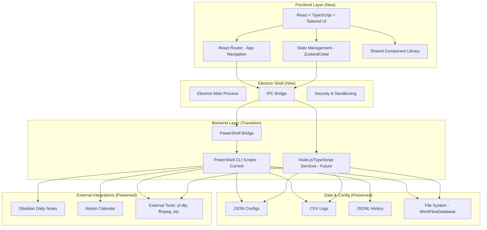

# Target Architecture: Gesu Ecosystem v2 (React + TypeScript + Tailwind + Electron)

## Vision

Gesu Ecosystem v2 will be a **modern, cross-platform productivity suite** with a **React-based UI layer** running on top of the proven PowerShell backend (initially), wrapped in an **Electron desktop shell**. This hybrid approach enables **incremental migration** while preserving the battle-tested workflow logic.

**Core Principles**:
1. ✨ **Modern UI/UX** - React + Tailwind for beautiful, responsive interfaces
2. 🔄 **Gradual migration** - Reuse PowerShell CLIs as backend initially, migrate to Node/TS later
3. 📱 **Cross-platform ready** - Electron enables Windows/Mac/Linux support
4. 🎨 **Premium aesthetics** - Vibrant colors, smooth animations, glassmorphism
5. 🧩 **Component-based** - Reusable UI components across apps
6. 🔧 **Developer-friendly** - TypeScript type safety, hot reload, modern tooling

---

## High-Level Architecture



---

## Technology Stack

### **Frontend (NEW)**

| Layer | Technology | Why |
|-------|------------|-----|
| **UI Framework** | React 18+ | Component-based, huge ecosystem, proven at scale |
| **Language** | TypeScript | Type safety, better DX, catches errors early |
| **Styling** | Tailwind CSS | Utility-first, fast iteration, consistent design system |
| **Router** | React Router v6 | Standard for SPA navigation |
| **State Management** | Zustand or Jotai | Lightweight, simple API, no Redux boilerplate |
| **Charts/Viz** | Recharts or Chart.js | For GesuCompass analytics (energy trends, weekly stats) |
| **Forms** | React Hook Form | Performant, minimal re-renders |
| **Icons** | Lucide React | Modern, consistent icon set |
| **Animations** | Framer Motion | Smooth micro-interactions |

### **Desktop Shell (NEW)**

| Component | Technology | Why |
|-----------|------------|-----|
| **Desktop Runtime** | Electron | Cross-platform, Node.js access, mature ecosystem |
| **Build Tool** | Vite | Fast HMR, modern bundler, great DX |
| **Electron Builder** | electron-builder | Package for Windows/Mac/Linux installers |
| **IPC** | Electron IPC (contextBridge) | Secure communication between renderer and main process |

### **Backend (TRANSITION)**

**Phase 1 (Hybrid)**:
- PowerShell CLI scripts (existing) called via Electron main process
- `child_process.spawn()` to run `.ps1` scripts
- JSON stdin/stdout communication

**Phase 2 (Native)**:
- Node.js + TypeScript services
- Replace PowerShell logic incrementally
- Same JSON data formats for compatibility

**Phase 3 (Optional)**:
- Keep PowerShell for OS-specific tasks (Windows workflow automation)
- Use Node.js for cross-platform logic (file I/O, data processing, API calls)

---

## Application Structure

```
gesu-ecosystem-v2/
├── apps/                           # Monorepo: each app is a package
│   ├── gesu-shell/                 # Main Electron shell
│   │   ├── src/
│   │   │   ├── main/               # Electron main process
│   │   │   │   ├── index.ts        # Entry point
│   │   │   │   ├── ipc-handlers.ts # IPC handlers
│   │   │   │   └── ps-bridge.ts    # PowerShell execution bridge
│   │   │   └── renderer/           # React app
│   │   │       ├── App.tsx
│   │   │       ├── routes/         # React Router setup
│   │   │       ├── components/     # Shared components
│   │   │       ├── stores/         # State management
│   │   │       └── styles/         # Tailwind config
│   │   ├── package.json
│   │   └── vite.config.ts
│   │
│   ├── gesu-launcher/              # GesuLauncher React UI
│   ├── gesu-compass/               # GesuCompass React UI
│   ├── gesu-refocus/               # GesuRefocus React UI
│   ├── gesu-media-suite/           # GesuMediaSuite React UI
│   ├── gesu-initiator/             # GesuInitiator React UI
│   └── gesu-settings/              # GesuSettings React UI
│
├── packages/                       # Shared packages
│   ├── ui/                         # Shared React components
│   ├── types/                      # TypeScript type definitions
│   ├── utils/                      # Shared utilities
│   └── config/                     # Shared configs (Tailwind, ESLint, TS)
│
├── services/                       # Backend services (future)
│   ├── node-compass/               # Node.js replacement for GesuCompass CLI
│   ├── node-media/                 # Node.js replacement for GesuMedia CLI
│   └── ...
│
├── docs/                           # Documentation (this file!)
│
├── _legacy-ps/                     # PowerShell scripts (transitional)
│   └── (symlink to _backup-reference or copy of CLIs)
│
└── package.json                    # Root package.json for monorepo
```

### **Monorepo Setup**

Use **pnpm workspaces** or **npm workspaces** for simplicity:

```json
{
  "name": "gesu-ecosystem-v2",
  "private": true,
  "workspaces": [
    "apps/*",
    "packages/*",
    "services/*"
  ]
}
```

---

## UI/UX Design Principles

### **Visual Aesthetics**

Following modern web design best practices:

1. **Dark mode first** - Reduce eye strain, premium feel
2. **Vibrant accent colors** - HSL-based palette (avoid generic red/blue)
   - Primary: Vibrant cyan `hsl(180, 70%, 50%)`
   - Success: Energetic green `hsl(140, 60%, 50%)`
   - Warning: Warm amber `hsl(40, 90%, 60%)`
   - Danger: Bold crimson `hsl(350, 80%, 55%)`
3. **Glassmorphism** - Semi-transparent cards with backdrop blur
4. **Smooth gradients** - Use CSS gradients for backgrounds and accents
5. **Micro-animations** - Hover effects, transitions (via Framer Motion)
6. **Custom fonts** - Google Fonts (Inter, Outfit, or Roboto) instead of system defaults

### **Component Design System**

Create a **reusable component library** in `packages/ui/`:

**Core Components**:
- `Button` - Primary, secondary, ghost variants
- `Card` - Glassmorphic card with optional glow effect
- `Input`, `Select`, `Checkbox` - Form controls with focus animations
- `Modal` - Slide-in/fade modals
- `Toast` - Notification system
- `Tabs` - For multi-page apps (GesuCompass, GesuMediaSuite)
- `ProgressBar`, `Spinner` - Loading states
- `Chart` - Wrapper around Recharts for consistent styling

**App-Specific Components**:
- `EnergySlider` (GesuCompass) - 0-10 slider with color gradient
- `TaskCard` (GesuCompass) - Task item with checkbox and area badge
- `FocusTimer` (GesuCompass) - Circular progress timer
- `MediaPresetPicker` (GesuMediaSuite) - Grid of download presets
- `ProjectCard` (GesuInitiator) - Project creation template card

---

## Data & Configuration

### **Preserve Existing Data Formats**

✅ **Do NOT change** JSON/CSV/JSONL structures initially  
✅ **Read/write** to the same `WorkFlowDatabase` folder structure  
✅ **Reuse** `Gesu.GlobalSettings.json` (but centralized, see below)

### **Configuration Management**

**Problem in v1**: Each app has its own copy of `Gesu.GlobalSettings.json`

**Solution in v2**: **Centralize global config** + app-specific configs

```
WorkFlowDatabase/
├── gesu.config.json              # NEW: Centralized global config
└── _Apps/
    ├── GesuCompass/
    │   └── config/
    │       ├── compass.config.json    # App-specific settings
    │       └── compass.tasks.json     # Task pools
    ├── GesuMediaSuite/
    │   └── config/
    │       ├── media.config.json      # App-specific settings
    │       └── media.presets.json     # Presets
    └── ...
```

**TypeScript Config Schema**:

```typescript
// packages/types/src/config.ts
export interface GesuGlobalConfig {
  workflowRoot: string;
  projectRoot: string;
  defaultFocusMinutes: number;
  integrations: {
    obsidian: {
      dailyNotesDir: string;
      dailyNotePattern: string; // "{yyyy-MM-dd}.md"
    };
    notion: {
      calendarExePath: string;
    };
  };
  theme: {
    mode: "dark" | "light";
    accentColor: string;
  };
}

export interface CompassConfig {
  tasksConfigPath: string;
  historyPath: string;
  defaultMode: "Recovery" | "Normal" | "Push";
}

export interface MediaSuiteConfig {
  outputFolder: string;
  toolsRoot: string;
  ytDlpPath: string;
  ffmpegPath: string;
  networkProfile: string;
}
```

### **Config Loading Strategy**

1. Electron main process reads `gesu.config.json` on startup
2. Sends config to renderer via IPC
3. React app stores in global state (Zustand)
4. GesuSettings app can edit and save back to JSON

---

## PowerShell Bridge (Transition Phase)

### **Why keep PowerShell initially?**

1. ✅ **Risk reduction** - Don't rewrite 5000+ lines of battle-tested logic all at once
2. ✅ **Incremental migration** - Get modern UI quickly, migrate backend gradually
3. ✅ **Preserve workflows** - Existing data formats and file structures work as-is
4. ✅ **Buy time** - Focus on UI/UX first, backend optimization later

### **How the bridge works**

**Electron Main Process** (`src/main/ps-bridge.ts`):

```typescript
import { spawn } from 'child_process';
import path from 'path';

export async function runPowerShellScript(
  scriptPath: string,
  args: string[]
): Promise<{ stdout: string; stderr: string; exitCode: number }> {
  return new Promise((resolve, reject) => {
    const ps = spawn('powershell.exe', [
      '-ExecutionPolicy', 'Bypass',
      '-NoProfile',
      '-File', scriptPath,
      ...args
    ]);

    let stdout = '';
    let stderr = '';

    ps.stdout.on('data', (data) => { stdout += data.toString(); });
    ps.stderr.on('data', (data) => { stderr += data.toString(); });

    ps.on('close', (code) => {
      resolve({ stdout, stderr, exitCode: code || 0 });
    });

    ps.on('error', reject);
  });
}
```

**React UI** (via IPC):

```typescript
// In GesuCompass React app
const checkEnergy = async () => {
  const result = await window.electron.invoke('ps:compass:check-energy', {
    energy: energyLevel,
    primaryArea: selectedArea
  });
  
  setTasks(result.tasks);
};
```

**IPC Handler** (`src/main/ipc-handlers.ts`):

```typescript
ipcMain.handle('ps:compass:check-energy', async (event, { energy, primaryArea }) => {
  const scriptPath = path.join(app.getAppPath(), '_legacy-ps/GesuCompass.ps1');
  
  // Pass data as JSON via stdin or args
  const result = await runPowerShellScript(scriptPath, [
    '-Energy', energy.toString(),
    '-Area', primaryArea,
    '-OutputFormat', 'json'
  ]);
  
  return JSON.parse(result.stdout);
});
```

### **Migration Path: PowerShell → Node.js**

**Phase 1**: All backend logic in PowerShell  
**Phase 2**: Port simple apps (Launcher, Refocus, Settings) to TypeScript  
**Phase 3**: Port complex apps (Compass) to TypeScript  
**Phase 4** (optional): Keep media processing in PowerShell (yt-dlp, ffmpeg wrappers are OS-agnostic via CLI anyway)

---

## Routing & Navigation

Use **React Router** for in-app navigation:

```tsx
// apps/gesu-shell/src/renderer/App.tsx
import { HashRouter, Routes, Route } from 'react-router-dom';

export function App() {
  return (
    <HashRouter>
      <AppShell>
        <Routes>
          <Route path="/" element={<LauncherHome />} />
          <Route path="/compass" element={<CompassApp />} />
          <Route path="/refocus" element={<RefocusApp />} />
          <Route path="/media" element={<MediaSuiteApp />} />
          <Route path="/initiator" element={<InitiatorApp />} />
          <Route path="/settings" element={<SettingsApp />} />
        </Routes>
      </AppShell>
    </HashRouter>
  );
}
```

**AppShell** component:
- Sidebar navigation (icons for each app)
- Top bar (current app title, settings icon)
- Dark mode toggle
- Glassmorphic background

---

## State Management

Use **Zustand** for global state (lightweight, simple API):

```typescript
// stores/useGlobalStore.ts
import create from 'zustand';

interface GlobalState {
  config: GesuGlobalConfig | null;
  currentProject: ProjectInfo | null;
  setConfig: (config: GesuGlobalConfig) => void;
  setCurrentProject: (project: ProjectInfo) => void;
}

export const useGlobalStore = create<GlobalState>((set) => ({
  config: null,
  currentProject: null,
  setConfig: (config) => set({ config }),
  setCurrentProject: (currentProject) => set({ currentProject }),
}));
```

**App-specific state** (e.g., GesuCompass):

```typescript
// stores/useCompassStore.ts
interface CompassState {
  energyLevel: number;
  mode: 'Recovery' | 'Normal' | 'Push';
  tasks: Task[];
  todayData: TodayData | null;
  setEnergyLevel: (level: number) => void;
  // ...
}

export const useCompassStore = create<CompassState>(/* ... */);
```

---

## Developer Experience

### **Hot Module Replacement (HMR)**

Vite provides instant HMR for React components - changes reflect in <200ms

### **TypeScript Type Safety**

All data structures typed:
- Configs (`GesuGlobalConfig`, `CompassConfig`, etc.)
- API responses (from PowerShell bridge or future Node.js services)
- Component props

### **Linting & Formatting**

- **ESLint** - Code quality
- **Prettier** - Consistent formatting
- **TypeScript strict mode** - Catch errors early

### **Testing** (Future Phase)

- **Vitest** - Unit tests for utils and stores
- **React Testing Library** - Component tests
- **Playwright** - E2E tests for Electron app

---

## Security Considerations

### **Electron Security Best Practices**

1. ✅ **Enable contextIsolation** - Prevent renderer from accessing Node.js directly
2. ✅ **Disable nodeIntegration** - Use preload scripts for IPC
3. ✅ **Use contextBridge** - Expose only safe APIs to renderer
4. ✅ **Sanitize inputs** - Always validate user input before passing to PowerShell/Node.js
5. ✅ **Content Security Policy (CSP)** - Restrict script sources

**Preload script example**:

```typescript
// src/main/preload.ts
import { contextBridge, ipcRenderer } from 'electron';

contextBridge.exposeInMainWorld('electron', {
  invoke: (channel: string, data: any) => ipcRenderer.invoke(channel, data),
  on: (channel: string, callback: Function) => {
    ipcRenderer.on(channel, (event, ...args) => callback(...args));
  },
});
```

**React usage**:

```typescript
// Type-safe window.electron
declare global {
  interface Window {
    electron: {
      invoke: <T = any>(channel: string, data?: any) => Promise<T>;
      on: (channel: string, callback: Function) => void;
    };
  }
}
```

---

## Build & Distribution

### **Development**

```bash
# Install dependencies
pnpm install

# Run Electron app with hot reload
cd apps/gesu-shell
pnpm dev
```

### **Production Build**

```bash
# Build for Windows
pnpm build:win

# Build for Mac
pnpm build:mac

# Build for Linux
pnpm build:linux
```

**Output**: Installers in `dist/` folder (`.exe` for Windows, `.dmg` for Mac, `.AppImage` for Linux)

---

## Future Enhancements (Post-Migration)

1. 🌐 **Web version** - Deploy React app to web for mobile/browser access
2. 📱 **Mobile apps** - React Native version for iOS/Android
3. ☁️ **Cloud sync** - Sync data across devices (optional, preserve local-first)
4. 🤖 **AI integration** - GPT-powered task suggestions, reflection analysis
5. 📊 **Advanced analytics** - ML-based energy pattern prediction, burnout detection
6. 🔗 **API layer** - REST/GraphQL API for third-party integrations

---

## Summary

Gesu Ecosystem v2 will be a **modern, cross-platform desktop app** built with:
- ✨ **React + TypeScript + Tailwind** for a beautiful, maintainable UI
- 🖥️ **Electron** for desktop shell with Node.js access
- 🔄 **PowerShell bridge** (transitional) to preserve existing CLI logic
- 📂 **Same data formats** (JSON/CSV/JSONL) for compatibility
- 🧩 **Component-based architecture** for code reuse
- 🎨 **Premium design system** (dark mode, glassmorphism, smooth animations)

**Migration strategy**: **UI first, backend later**  
**Risk level**: **Low** (incremental, preserve proven logic)  
**Time to first working app**: **~2-4 weeks** (GesuLauncher + GesuRefocus)
