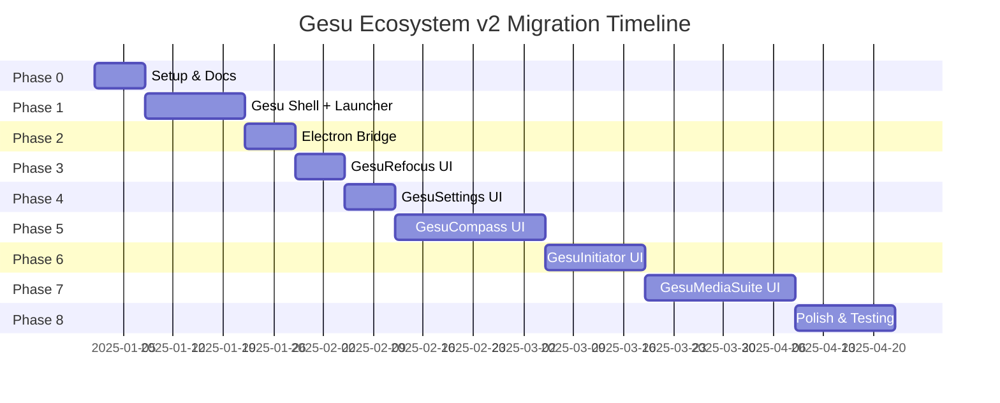

# Migration Plan: PowerShell + WPF → React + TypeScript + Tailwind + Electron

## Executive Summary

This document outlines a **safe, incremental migration strategy** to modernize the Gesu Ecosystem from PowerShell + WPF to React + TypeScript + Tailwind + Electron.

**Migration Approach**: **UI-first hybrid architecture**  
- Replace WPF GUIs with React immediately
- Keep PowerShell CLIs as backend initially (via Electron bridge)
- Migrate backend to Node.js/TypeScript gradually (optional, later)

**Timeline**: 12-16 weeks for core migration (solo developer with AI agent assistance)

**Risk Level**: 🟢 Low - Incremental, preserves existing data and logic

---

## Safety Rules (CRITICAL)

> [!CAUTION]
> **NEVER modify, delete, move, or rename anything in the backup folder:**  
> `D:\03. Resources\_Gesu's\Backup\WorkFlowDatabase-ps-stack-v1`
> 
> This folder is **READ-ONLY** for reference purposes only.

> [!WARNING]
> **ALL work happens ONLY inside the new workspace:**  
> `D:\03. Resources\_Gesu's\WorkFlowDatabase`
> 
> Do NOT run destructive commands (`rmdir /s`, `rm -rf`, `del /s`) against paths outside this workspace.

> [!IMPORTANT]
> **For any task involving file moves, renames, or deletions:**
> - **AI AGENT**: Generate the script/command but DO NOT auto-run it
> - **HUMAN REVIEW**: User must manually approve before execution
> - Label these tasks as **⚠️ REQUIRES HUMAN REVIEW** in the plan

---

## Migration Phases Overview



**Total Duration**: ~14 weeks (~3.5 months)

---

## Phase 0: Repository & Workspace Setup

**Goal**: Create a clean, modern development environment with Git, monorepo structure, and initial documentation.

**Duration**: 1 week  
**Risk**: 🟢 Low  
**Dependencies**: None

### Tasks

#### 0.1: Initialize Git Repository ✅ SAFE TO DELEGATE

```bash
cd "D:\03. Resources\_Gesu's\WorkFlowDatabase"
git init
git add docs/
git commit -m "docs: Add current state, target architecture, and migration plan"
```

**Done Criteria**: Git repo initialized, first commit with docs

---

#### 0.2: Create `.gitignore` ✅ SAFE TO DELEGATE

Create `.gitignore` to exclude:
- `node_modules/`
- `dist/`
- `*.log`
- `.env*`
- OS files (`.DS_Store`, `Thumbs.db`)
- IDE files (`.vscode/`, `.idea/`)
- Build artifacts

**Done Criteria**: `.gitignore` committed

---

#### 0.3: Create Monorepo Structure ✅ SAFE TO DELEGATE

```bash
# Create root structure
mkdir -p apps/gesu-shell/src/{main,renderer}
mkdir -p packages/{ui,types,utils,config}
mkdir -p services
mkdir -p _legacy-ps

# Create root package.json
```

**Root `package.json`**:

```json
{
  "name": "gesu-ecosystem-v2",
  "version": "2.0.0",
  "private": true,
  "workspaces": [
    "apps/*",
    "packages/*",
    "services/*"
  ],
  "scripts": {
    "dev": "pnpm --filter gesu-shell dev",
    "build": "pnpm -r build",
    "lint": "pnpm -r lint",
    "typecheck": "pnpm -r typecheck"
  },
  "devDependencies": {
    "@types/node": "^20.0.0",
    "typescript": "^5.3.0",
    "prettier": "^3.1.0",
    "eslint": "^8.56.0"
  },
  "engines": {
    "node": ">=18.0.0",
    "pnpm": ">=8.0.0"
  }
}
```

**Done Criteria**: Folder structure created, `pnpm install` runs successfully

---

#### 0.4: Copy PowerShell CLIs to `_legacy-ps/` ⚠️ REQUIRES HUMAN REVIEW

**Task**: Copy (not move!) the PowerShell CLI scripts from `_backup-reference/_Apps/*/bin/*.ps1` to `_legacy-ps/` for the Electron bridge to call.

**Why manual review?** This involves copying ~20+ files; human should verify paths are correct.

**Commands** (for human to review):

```powershell
# Create _legacy-ps structure
New-Item -ItemType Directory -Path "_legacy-ps" -Force

# Copy each app's CLI scripts (NOT the GUI scripts)
Copy-Item -Path "_backup-reference/_Apps/GesuLauncher/bin/GesuLauncher.ps1" -Destination "_legacy-ps/"
Copy-Item -Path "_backup-reference/_Apps/GesuCompass/bin/GesuCompass.ps1" -Destination "_legacy-ps/"
Copy-Item -Path "_backup-reference/_Apps/GesuRefocus/bin/GesuRefocus.ps1" -Destination "_legacy-ps/"
Copy-Item -Path "_backup-reference/_Apps/GesuMediaSuite/bin/GesuMediaSuite.ps1" -Destination "_legacy-ps/"
Copy-Item -Path "_backup-reference/_Apps/GesuInitiator/bin/GesuInitiator.ps1" -Destination "_legacy-ps/"
Copy-Item -Path "_backup-reference/_Apps/GesuSettings/bin/GesuSettings.ps1" -Destination "_legacy-ps/"

# Copy shared modules
Copy-Item -Path "_backup-reference/_Core/Modules" -Destination "_legacy-ps/" -Recurse
```

**Done Criteria**: All PowerShell CLIs copied to `_legacy-ps/`, Git commit

---

#### 0.5: Document Folder Structure ✅ SAFE TO DELEGATE

Create `docs/00_FolderStructure.md` explaining the new v2 layout.

**Done Criteria**: Documentation updated

---

### Phase 0 Completion Checklist

- [x] Git repo initialized
- [x] `.gitignore` created
- [x] Monorepo structure (`apps/`, `packages/`, `services/`) created
- [x] Root `package.json` with workspaces configured
- [x] PowerShell CLIs copied to `_legacy-ps/` (human review)
- [x] Folder structure documented

**Milestone**: Clean workspace ready for development

---

## Phase 1: Gesu Shell + React Launcher UI

**Goal**: Create the main Electron app shell with a basic React + Tailwind launcher (no backend yet, just UI).

**Duration**: 2 weeks  
**Risk**: 🟢 Low  
**Dependencies**: Phase 0

### Tasks

#### 1.1: Initialize Electron + Vite App ✅ SAFE TO DELEGATE

```bash
cd apps/gesu-shell

# Use electron-vite starter (or manual setup)
pnpm create @quick-start/electron
# OR manually install:
pnpm add electron electron-builder
pnpm add -D vite @vitejs/plugin-react typescript
```

**`package.json`** for `apps/gesu-shell`:

```json
{
  "name": "gesu-shell",
  "version": "2.0.0",
  "main": "dist-electron/main.js",
  "scripts": {
    "dev": "vite",
    "build": "vite build && electron-builder",
    "preview": "vite preview"
  },
  "dependencies": {
    "electron": "^28.0.0"
  },
  "devDependencies": {
    "@vitejs/plugin-react": "^4.2.0",
    "electron-builder": "^24.9.0",
    "vite": "^5.0.0",
    "typescript": "^5.3.0"
  }
}
```

**Done Criteria**: `pnpm dev` launches a blank Electron window

---

#### 1.2: Set Up Electron Main Process ✅ SAFE TO DELEGATE

Create `apps/gesu-shell/src/main/index.ts`:

```typescript
import { app, BrowserWindow } from 'electron';
import path from 'path';

let mainWindow: BrowserWindow | null = null;

function createWindow() {
  mainWindow = new BrowserWindow({
    width: 1200,
    height: 800,
    webPreferences: {
      preload: path.join(__dirname, 'preload.js'),
      contextIsolation: true,
      nodeIntegration: false,
    },
  });

  if (process.env.VITE_DEV_SERVER_URL) {
    mainWindow.loadURL(process.env.VITE_DEV_SERVER_URL);
  } else {
    mainWindow.loadFile(path.join(__dirname, '../renderer/index.html'));
  }
}

app.whenReady().then(createWindow);

app.on('window-all-closed', () => {
  if (process.platform !== 'darwin') app.quit();
});
```

**Done Criteria**: Electron window loads and shows "Hello World" React app

---

#### 1.3: Install React + TypeScript + Tailwind ✅ SAFE TO DELEGATE

```bash
cd apps/gesu-shell
pnpm add react react-dom react-router-dom
pnpm add -D @types/react @types/react-dom tailwindcss postcss autoprefixer
npx tailwindcss init -p
```

**Tailwind Config** (`tailwind.config.js`):

```javascript
/** @type {import('tailwindcss').Config} */
export default {
  content: ['./src/renderer/**/*.{js,ts,jsx,tsx}'],
  theme: {
    extend: {
      colors: {
        primary: 'hsl(180, 70%, 50%)',
        success: 'hsl(140, 60%, 50%)',
        warning: 'hsl(40, 90%, 60%)',
        danger: 'hsl(350, 80%, 55%)',
      },
    },
  },
  plugins: [],
};
```

**Done Criteria**: Tailwind classes work in React components

---

#### 1.4: Create Design System (Shared Components) ✅ SAFE TO DELEGATE

In `packages/ui/src/`, create:
- `Button.tsx` - Primary/secondary/ghost variants
- `Card.tsx` - Glassmorphic card
- `Input.tsx`, `Select.tsx` - Form controls
- `Layout.tsx` - AppShell with sidebar navigation

**Example `Button.tsx`**:

```tsx
import { ButtonHTMLAttributes } from 'react';
import { clsx } from 'clsx';

type ButtonVariant = 'primary' | 'secondary' | 'ghost';

interface ButtonProps extends ButtonHTMLAttributes<HTMLButtonElement> {
  variant?: ButtonVariant;
}

export function Button({ variant = 'primary', className, children, ...props }: ButtonProps) {
  return (
    <button
      className={clsx(
        'px-4 py-2 rounded-lg font-medium transition-all',
        {
          'bg-primary text-black hover:bg-primary/80': variant === 'primary',
          'bg-gray-700 text-white hover:bg-gray-600': variant === 'secondary',
          'bg-transparent text-gray-300 hover:bg-gray-800': variant === 'ghost',
        },
        className
      )}
      {...props}
    >
      {children}
    </button>
  );
}
```

**Done Criteria**: Reusable components in `packages/ui`, importable in `apps/gesu-shell`

---

#### 1.5: Build GesuLauncher UI (No Backend) ✅ SAFE TO DELEGATE

Create `apps/gesu-shell/src/renderer/pages/Launcher.tsx`:

**Features**:
- Show current date/time
- Display WorkflowRoot path (hardcoded for now)
- Show last project (mock data for now)
- Grid of app cards with icons:
  - GesuInitiator (New Project)
  - GesuMediaSuite (Downloads)
  - GesuCompass (Daily Coach)
  - GesuRefocus (Refocus)
  - GesuSettings (Settings)
- Click handlers (do nothing yet, just log to console)

**UI Design**:
- Dark mode background with gradient
- Glassmorphic cards with hover glow effect
- Icons from `lucide-react`
- Smooth hover animations (Framer Motion)

**Done Criteria**: Launcher UI looks awesome, all cards clickable (even if they don't do anything yet)

---

#### 1.6: Add React Router Navigation ✅ SAFE TO DELEGATE

Set up routes:
- `/` → Launcher home
- `/compass` → GesuCompass (placeholder)
- `/refocus` → GesuRefocus (placeholder)
- `/media` → GesuMediaSuite (placeholder)
- `/initiator` → GesuInitiator (placeholder)
- `/settings` → GesuSettings (placeholder)

**App.tsx**:

```tsx
import { HashRouter, Routes, Route } from 'react-router-dom';
import { AppShell } from '@gesu/ui';
import { Launcher } from './pages/Launcher';

export function App() {
  return (
    <HashRouter>
      <AppShell>
        <Routes>
          <Route path="/" element={<Launcher />} />
          <Route path="/compass" element={<div>Compass (Coming soon)</div>} />
          {/* ... other routes */}
        </Routes>
      </AppShell>
    </HashRouter>
  );
}
```

**Done Criteria**: Clicking app cards navigates to placeholder pages, back button works

---

### Phase 1 Completion Checklist

- [x] Electron app runs with Vite dev server
- [x] React + TypeScript + Tailwind configured
- [x] Shared component library (`packages/ui`) created
- [x] GesuLauncher UI built with stunning visuals
- [x] React Router navigation working
- [x] All app cards functional (even if they don't call backend yet)

**Milestone**: Modern UI shell ready, navigation working

---

## Phase 2: Electron ↔ PowerShell Bridge

**Goal**: Enable the React UI to safely call existing PowerShell CLI scripts via Electron IPC.

**Duration**: 1 week  
**Risk**: 🟡 Medium (security-sensitive, requires careful input validation)  
**Dependencies**: Phase 1

### Tasks

#### 2.1: Create Preload Script (Security) ✅ SAFE TO DELEGATE

Create `apps/gesu-shell/src/main/preload.ts`:

```typescript
import { contextBridge, ipcRenderer } from 'electron';

contextBridge.exposeInMainWorld('electron', {
  invoke: (channel: string, data?: any) => ipcRenderer.invoke(channel, data),
  on: (channel: string, callback: (data: any) => void) => {
    ipcRenderer.on(channel, (_, data) => callback(data));
  },
});
```

**Done Criteria**: `window.electron.invoke()` callable from React (TypeScript types defined)

---

#### 2.2: Create PowerShell Executor Utility ⚠️ REQUIRES HUMAN REVIEW

Create `apps/gesu-shell/src/main/ps-bridge.ts`:

```typescript
import { spawn } from 'child_process';
import path from 'path';
import { app } from 'electron';

export interface PSResult {
  stdout: string;
  stderr: string;
  exitCode: number;
}

export async function runPowerShell(
  scriptName: string,
  args: string[] = []
): Promise<PSResult> {
  const scriptPath = path.join(app.getAppPath(), '_legacy-ps', scriptName);

  return new Promise((resolve, reject) => {
    const ps = spawn('powershell.exe', [
      '-ExecutionPolicy', 'Bypass',
      '-NoProfile',
      '-File', scriptPath,
      ...args,
    ]);

    let stdout = '';
    let stderr = '';

    ps.stdout.on('data', (data) => { stdout += data.toString(); });
    ps.stderr.on('data', (data) => { stderr += data.toString(); });

    ps.on('close', (code) => {
      resolve({ stdout, stderr, exitCode: code || 0 });
    });

    ps.on('error', (err) => reject(err));
  });
}
```

**Why review?** This executes arbitrary PowerShell - must validate inputs carefully.

**Done Criteria**: Test function by running a simple PowerShell command, verify output

---

#### 2.3: Add IPC Handlers for PowerShell Calls ✅ SAFE TO DELEGATE

Create `apps/gesu-shell/src/main/ipc-handlers.ts`:

```typescript
import { ipcMain } from 'electron';
import { runPowerShell } from './ps-bridge';

export function registerIPCHandlers() {
  // Example: Get current project info
  ipcMain.handle('ps:get-project-info', async () => {
    const result = await runPowerShell('GesuLauncher.ps1', ['-Mode', 'GetProjectInfo']);
    return JSON.parse(result.stdout);
  });

  // Add more handlers as needed
}
```

Call `registerIPCHandlers()` in `main/index.ts` after `app.whenReady()`.

**Done Criteria**: React can call `window.electron.invoke('ps:get-project-info')` and get data

---

#### 2.4: Update Launcher to Use Real Data ✅ SAFE TO DELEGATE

Modify `Launcher.tsx` to fetch current project from PowerShell:

```tsx
const [projectInfo, setProjectInfo] = useState(null);

useEffect(() => {
  window.electron.invoke('ps:get-project-info').then(setProjectInfo);
}, []);
```

**Done Criteria**: Launcher shows real last project from `ProjectLog.csv`

---

### Phase 2 Completion Checklist

- [x] Preload script with contextBridge configured
- [x] PowerShell executor utility (`ps-bridge.ts`) created
- [x] IPC handlers registered for PS script calls
- [x] Launcher fetches real project data from PowerShell
- [x] Security: Input validation added to IPC handlers

#### 2.5: Refining Download Jobs (Media Suite) ✅ DONE
- [x] Download job object includes: id, url, preset, and network
- [x] Selected network profile wired to yt-dlp arguments (e.g. gaspol -> --limit-rate 5M)
- [x] Console logging added: "[download job]" showing payload and args

#### 2.6: Media Suite Job History (Recent Jobs) ✅ DONE
- [x] Backend: `mediaSuite:getRecentJobs` IPC handler reads from `apps/gesu-shell/logs/media-suite-jobs.log`
- [x] Frontend: "History" tab added to MediaSuitePage showing recent jobs table
- [x] Features: Auto-refresh on enqueue, manual refresh, status badges, details view

#### 2.7: Media Suite Output Routing (Shell vs WorkFlowDB) ✅ DONE
- [x] UI: "Save to" option (Gesu Shell / WorkFlow Database)
- [x] Backend: Output directory selection logic (local `downloads/` vs `WorkFlowDatabase path`)
- [x] Logging & History: `target` field persisted in logs and displayed in History tab ("Shell" vs "WF DB")

#### 2.8: Downloader UX / QoL Refinements ✅ DONE
- [x] Notifications: Replaced blocking alerts with non-blocking toast notifications
- [x] Labels: Human-readable network profiles (e.g. "gaspol · ~5 MB/s")
- [x] Actions: "Open Shell Folder" and "Open WF DB Folder" buttons wired to `shell.openPath`

#### 2.9: Converter Pipeline Baseline (MS-7a) ✅ DONE
- [x] Backend: Implemented `processConvertJob` with FFmpeg spawning
- [x] Presets: Added `CONVERT_PRESETS` map (Audio MP3 320/192, Video MP4 1080p)
- [x] UI/UX: Converter tab with file picker, preset selection, and output routing
- [x] Integration: Convert jobs logged in JSONL and displayed in History

#### 2.10: MS-7b: Audio Converter Presets (MP3/WAV/AAC) ✅ DONE
- [x] Backend: Added FFmpeg args for WAV (48kHz) and AAC (256kbps)
- [x] Types: Updated `MediaConvertPresetId` with new audio formats
- [x] UI: Grouped preset selector (Audio/Video optgroups) for better organization

#### 2.11: MS-7c: Video Converter Presets (1080p / 720p / 540p-lite) ✅ DONE
- [x] Backend: Added FFmpeg args for 720p and 540p-lite (optimized H.264 profiles)
- [x] UI: Expanded video preset options (HQ, Standard, Lite)
- [x] Validation: Confirmed successful MP4 encoding for all resolutions

#### 2.12: MS-7d: Advanced Converter Mode ✅ DONE
- [x] UI: Added "Simple" vs "Advanced" mode toggle
- [x] Features: Custom resolution, CRF quality, and audio profile selection
- [x] Backend: Implemented `video-advanced` preset with dynamic FFmpeg args logic
- [x] Logging: Extended job logger to capture `advancedOptions` payload

### Media Suite Completion Checklist

- [x] Integrate Media Suite Job System (Download & Convert)
- [x] MS-7a: Baseline converter pipeline (simple ffmpeg convert job)
- [x] MS-7b: Audio presets (MP3 320/192, WAV 48k, AAC 256)
- [x] MS-7c: Video presets (MP4 1080p HQ, 720p, 540p Lite)
- [x] MS-7d: Advanced converter mode (resolution / quality / audio options)
- [x] MS-7e: Media Suite UI polish (History + Job Queue)
    - Human-readable preset labels in History and Job Queue
    - Type badges in History (DL / CV / ADV)
    - Advanced options summary in Converter and Job Queue
    - Layout/spacing tweaks for Media Suite pages
- [x] MS-8: Sprint 14 - Smart Category System & Bug Fixes
    - Fixed history filter bug (use job.type instead of preset prefix)
    - Fixed convert job completion auto-refresh
    - Added Category dropdown (Video, Audio, Image) with auto-detection
    - Implemented file extension detection (EXT_VIDEO/AUDIO/IMAGE)
    - Auto-select category on file browse, filter presets by category
    - Added output folder persistence (localStorage)
- [x] MS-9: Sprint 14 - Image Conversion & UI Polish
    - Added ImageMagick support with 4 presets (PNG, JPG-90, WebP, ICO-256)
    - Implemented getImageMagickArgs() function
    - Enhanced empty state UI with icons and proper sizing
    - Set minimum card heights to prevent dropdown cutoff
    - Optimized dropdown layout (Category auto-width, Preset flex-1)

### Media Suite Next Steps / Backlog
- Optional: FFmpeg progress percentage (requires duration detection)
- Optional: History pagination or date-based grouping
- Optional: Quick actions in Job Queue (open folder, re-run job)
- Optional: Batch conversion support
- Optional: Custom preset creation UI

**Milestone**: Media Suite fully implemented (Downloader + Converter + Advanced Mode + Category System + Image Support + Polished UI)

---

## Phase 3: GesuRefocus React UI

**Goal**: Migrate GesuRefocus from WPF to React.

**Duration**: 1 week  
**Risk**: 🟢 Low (simple form-based UI)  
**Dependencies**: Phase 2

### Tasks

#### 3.1: Design GesuRefocus React UI ✅ SAFE TO DELEGATE

**Features**:
1. 4-step questionnaire:
   - Step 1: Feeling (text input)
   - Step 2: Overwhelm level (0-10 slider)
   - Step 3: Basic needs (Y/N radio buttons)
   - Step 4: Self-harm screening (Y/N + crisis resources if Yes)
2. Recovery options (4 cards to choose from)
3. Submit → Call PowerShell script → Show confirmation

**UI Components**:
- `QuestionCard` - Glassmorphic card for each question
- `Slider` (from `packages/ui`) - Energy/overwhelm slider
- `RecoveryOptionCard` - Clickable card with icon

**Done Criteria**: UI mocked up, navigation between steps works

---

#### 3.2: Add IPC Handler for GesuRefocus ✅ SAFE TO DELEGATE

In `ipc-handlers.ts`:

```typescript
ipcMain.handle('ps:refocus:submit', async (event, data) => {
  const { feeling, level, needs, harm, recoveryOption } = data;
  
  const result = await runPowerShell('GesuRefocus.ps1', [
    '-Feeling', feeling,
    '-Level', level.toString(),
    '-Needs', needs,
    '-Harm', harm,
    '-RecoveryOption', recoveryOption,
  ]);
  
  return { success: result.exitCode === 0 };
});
```

**Done Criteria**: React form submits to PowerShell, confirmation shown

---

#### 3.3: Test GesuRefocus End-to-End ⚠️ REQUIRES HUMAN REVIEW

**Manual Test**:
1. Open GesuRefocus from Launcher
2. Fill out all 4 questions
3. Select recovery option
4. Submit
5. Verify:
   - Data written to Obsidian Daily Note (check the `.md` file manually)
   - No errors in Electron console
   - Confirmation message shown in UI

**Done Criteria**: Human verifies Obsidian file updated correctly

---

### Phase 3 Completion Checklist

- [x] GesuRefocus React UI built
- [x] IPC handler for `ps:refocus:submit` working
- [x] End-to-end test passed (human verification)
- [x] Route added to React Router (`/refocus`)

**Milestone**: GesuRefocus fully migrated to React

---

## Phase 4: GesuSettings React UI

**Goal**: Migrate GesuSettings to React, enable editing `gesu.config.json`.

**Duration**: 1 week  
**Risk**: 🟡 Medium (config changes affect all apps)  
**Dependencies**: Phase 3

### Tasks

#### 4.1: Centralize Global Config ⚠️ REQUIRES HUMAN REVIEW

**Task**: Create a single `gesu.config.json` at workspace root instead of duplicates in each app's `config/` folder.

**Why review?** This changes the config strategy; human should verify it won't break existing PowerShell scripts.

**Script** (for agent to generate, human to review):

```powershell
# Create centralized config
$config = @{
  workflowRoot = "D:\03. Resources\_Gesu's\WorkFlowDatabase"
  projectRoot = "D:\01. Projects"
  defaultFocusMinutes = 15
  integrations = @{
    obsidian = @{
      dailyNotesDir = "C:\Users\Surya\OneDrive\Dokumen\3. Resources\Obsidian\Zettelkasten\Daily Note"
      dailyNotePattern = "{yyyy-MM-dd}.md"
    }
    notion = @{
      calendarExePath = "C:\Users\Surya\AppData\Local\Programs\cron-web\Notion Calendar.exe"
    }
  }
  theme = @{
    mode = "dark"
    accentColor = "hsl(180, 70%, 50%)"
  }
}

$config | ConvertTo-Json -Depth 4 | Out-File -FilePath "gesu.config.json" -Encoding UTF8
```

**Done Criteria**: `gesu.config.json` created, old configs backed up (not deleted)

---

#### 4.2: Build GesuSettings React UI ✅ SAFE TO DELEGATE

**Features**:
- Form to edit all config fields
- Tabs for different sections (Paths, Integrations, Theme)
- Save button → IPC call → Update `gesu.config.json`

**UI Components**:
- `ConfigField` - Label + Input
- `FilePicker` - Input + Browse button (use Electron dialog)
- `ColorPicker` - For accent color

**Done Criteria**: Settings UI shows current config values

---

#### 4.3: Add IPC Handlers for Config Read/Write ⚠️ REQUIRES HUMAN REVIEW

```typescript
ipcMain.handle('config:read', async () => {
  const configPath = path.join(app.getAppPath(), 'gesu.config.json');
  const data = await fs.promises.readFile(configPath, 'utf8');
  return JSON.parse(data);
});

ipcMain.handle('config:write', async (event, newConfig) => {
  const configPath = path.join(app.getAppPath(), 'gesu.config.json');
  await fs.promises.writeFile(configPath, JSON.stringify(newConfig, null, 2));
  return { success: true };
});
```

**Why review?** Writing config files is risky - validate inputs carefully.

**Done Criteria**: Settings UI can save and reload config

---

#### 4.4: Add File/Folder Picker Dialogs ✅ SAFE TO DELEGATE

Use Electron's `dialog.showOpenDialog()`:

```typescript
ipcMain.handle('dialog:pick-folder', async () => {
  const result = await dialog.showOpenDialog({
    properties: ['openDirectory'],
  });
  return result.filePaths[0];
});
```

**Done Criteria**: BFrowse buttons in Settings UI open native file picker

---

### Phase 4 Completion Checklist

- [x] `gesu.config.json` centralized at workspace root (Using `Gesu.GlobalSettings.json` with legacy support)
- [x] GesuSettings React UI built
- [x] Config read/write IPC handlers working (atomic write)
- [x] Auto-restart Electron main/preload in dev (dev:desktop:watch)
- [x] File picker dialogs functional (Settings UI browse)
- [x] Refactor Media Suite to read tool paths from Settings
- [x] Tool status sync: configured vs PATH fallback, refresh in Settings + Media Suite
- [x] Centralize settings usage (shared hook + IPC sync)
- [ ] Manual test: Edit config, restart app, verify changes persist
- [ ] Manual test: Edit config, restart app, verify changes persist

**Milestone**: GesuSettings migrated, centralized config working

---

## Phase 5: GesuCompass React UI

**Goal**: Migrate GesuCompass to React (most complex UI: tabs, charts, focus timer).

**Duration**: 3 weeks  
**Risk**: 🟡 Medium (complex state management, analytics)  
**Dependencies**: Phase 4

### Tasks

#### 5.1: Design GesuCompass UI Layout ✅ SAFE TO DELEGATE

**Tabs**:
1. **Today** - Morning routine (energy, mode, tasks)
2. **Focus** - Pomodoro timer with project selection
3. **Weekly** - Energy trends chart, accuracy stats

**UI Components**:
- `EnergySlider` - 0-10 slider with gradient colors
- `ModeCard` - Recovery/Normal/Push mode selector
- `TaskCard` - Task item with checkbox
- `FocusTimer` - Circular progress timer
- `EnergyChart` - Line chart using Recharts

**Done Criteria**: UI mockup ready, all tabs navigable

---

#### 5.2: Implement "Today" Tab (Morning Routine) ✅ SAFE TO DELEGATE

**Flow**:
1. Ask energy level (slider)
2. Determine mode (auto-select based on energy)
3. Ask primary life area (6 buttons)
4. Generate random tasks (call PowerShell script)
5. Show tasks with checkboxes

**IPC Handler**:

```typescript
ipcMain.handle('ps:compass:generate-tasks', async (event, { energy, primaryArea }) => {
  const result = await runPowerShell('GesuCompass.ps1', [
    '-Mode', 'GenerateTasks',
    '-Energy', energy.toString(),
    '-Area', primaryArea,
  ]);
  return JSON.parse(result.stdout);
});
```

**Done Criteria**: Morning routine flow works end-to-end

---

#### 5.3: Implement "Focus" Tab (Pomodoro Timer) ✅ SAFE TO DELEGATE

**Features**:
- Project selector (dropdown from `ProjectLog.csv`)
- Timer duration picker (15/25/45 min)
- Start/Pause/Stop buttons
- Circular progress indicator (use SVG or Framer Motion)

**State Management**: Use Zustand to track timer state globally.

**IPC Handler** (log focus session):

```typescript
ipcMain.handle('ps:compass:log-focus', async (event, { projectCode, duration, completed }) => {
  // Call PowerShell to log to Compass.History.jsonl
});
```

**Done Criteria**: Timer counts down, logs to history when complete

---

#### 5.4: Implement "Weekly" Tab (Analytics) ✅ SAFE TO DELEGATE

**Charts**:
1. **Energy trend** - Line chart of daily energy levels (last 7 days)
2. **Accuracy trend** - Line chart of task accuracy % (last 7 days)
3. **Focus time** - Bar chart of hours focused per day

**Data Source**: Read `Compass.History.jsonl` via IPC.

**IPC Handler**:

```typescript
ipcMain.handle('ps:compass:get-weekly-stats', async () => {
  const result = await runPowerShell('GesuCompass.ps1', ['-Mode', 'GetWeeklyStats']);
  return JSON.parse(result.stdout);
});
```

**Use Recharts** for visualization:

```tsx
import { LineChart, Line, XAxis, YAxis, Tooltip } from 'recharts';

<LineChart data={weeklyData}>
  <Line type="monotone" dataKey="energy" stroke="#00D9FF" />
  <XAxis dataKey="date" />
  <YAxis />
  <Tooltip />
</LineChart>
```

**Done Criteria**: Charts render with real data from history file

---

#### 5.5: Add Task Check/Uncheck Functionality ✅ SAFE TO DELEGATE

**Feature**: Clicking a task checkbox marks it done in `Compass.Today.json`.

**IPC Handler**:

```typescript
ipcMain.handle('ps:compass:toggle-task', async (event, { taskId, done }) => {
  // Call PowerShell to update Today.json
});
```

**Done Criteria**: Task state persists across app restarts

---

### Phase 5 Completion Checklist

- [x] GesuCompass UI with 3 tabs (Today, Focus, Weekly)
- [x] Morning routine flow working
- [x] Pomodoro timer functional
- [x] Weekly analytics charts rendering
- [x] Task checkbox state persistence
- [x] Manual test: Complete full morning routine, run focus session, check weekly stats

**Milestone**: GesuCompass fully migrated to React

---

## Phase 6: GesuInitiator React UI

**Goal**: Migrate GesuInitiator to React.

**Duration**: 2 weeks  
**Risk**: 🟡 Medium (involves file system operations)  
**Dependencies**: Phase 5

### Tasks

#### 6.1: Design Project Creation Flow ✅ SAFE TO DELEGATE

**Steps**:
1. Select project category (dropdown)
2. Enter client name
3. Auto-generate project code (e.g., `CLI-2025-001`)
4. Select project template (if applicable)
5. Preview folder structure
6. Confirm → Create folders + log to `ProjectLog.csv`

**Done Criteria**: UI flow designed, all steps navigable

---

#### 6.2: Add IPC Handler for Project Creation ⚠️ REQUIRES HUMAN REVIEW

```typescript
ipcMain.handle('ps:initiator:create-project', async (event, projectData) => {
  const result = await runPowerShell('GesuInitiator.ps1', [
    '-Category', projectData.category,
    '-Client', projectData.client,
    '-Template', projectData.template || 'default',
  ]);
  return { success: result.exitCode === 0, projectCode: result.stdout.trim() };
});
```

**Why review?** This creates folders - must validate paths carefully to avoid creating files outside `ProjectRoot`.

**Done Criteria**: PowerShell script creates project folder, logs to CSV

---

#### 6.3: Display Recent Projects ✅ SAFE TO DELEGATE

**Feature**: Show list of recent projects from `ProjectLog.csv`.

**IPC Handler**:

```typescript
ipcMain.handle('ps:initiator:get-recent-projects', async () => {
  const result = await runPowerShell('GesuInitiator.ps1', ['-Mode', 'GetRecentProjects']);
  return JSON.parse(result.stdout);
});
```

**Done Criteria**: Recent projects list shown in UI

---

### Phase 6 Completion Checklist

- [x] GesuInitiator UI built
- [x] Project creation flow working
- [x] Projects logged to `ProjectLog.csv`
- [x] Recent projects list rendered
- [x] Manual test: Create a project, verify folder structure created correctly

**Milestone**: GesuInitiator migrated to React

---

## Phase 7: GesuMediaSuite React UI

**Goal**: Migrate GesuMediaSuite to React (most complex app).

**Duration**: 3 weeks  
**Risk**: 🔴 High (real-time progress, file system ops, external tools)  
**Dependencies**: Phase 6

### Tasks

#### 7.1: Design MediaSuite UI ✅ SAFE TO DELEGATE

**Tabs**:
1. **Download** - URL input, preset picker, network profile, start download
2. **Convert** - File picker, conversion preset, start conversion
3. **History** - Table of past downloads/conversions

**UI Components**:
- `PresetCard` - Grid of download presets (Music MP3, Best Video, etc.)
- `ProgressBar` - Real-time download progress
- `NetworkProfileSelector` - Hemat / Normal / Gaspol

**Done Criteria**: UI mockup ready

---

#### 7.2: Implement Download Tab with Real-Time Progress ⚠️ REQUIRES HUMAN REVIEW

**Challenge**: PowerShell scripts output progress to stdout, need to stream this to React UI.

**Solution**: Use IPC events (not just `invoke`, but streaming).

**PowerShell Script Update** (agent can generate, human reviews):

Modify `GesuMediaSuite.ps1` to output progress as JSON lines:

```powershell
# Example progress output
Write-Output '{"type":"progress","percent":25,"file":"video.mp4"}'
```

**IPC Handler** (streaming):

```typescript
ipcMain.handle('ps:media:download', (event, { url, preset }) => {
  const ps = spawn('powershell.exe', ['-File', '_legacy-ps/GesuMediaSuite.ps1', '-URL', url, '-Preset', preset]);

  ps.stdout.on('data', (data) => {
    event.sender.send('ps:media:progress', data.toString());
  });

  ps.on('close', (code) => {
    event.sender.send('ps:media:complete', { success: code === 0 });
  });
});
```

**React UI**:

```tsx
useEffect(() => {
  window.electron.on('ps:media:progress', (data) => {
    setProgress(JSON.parse(data).percent);
  });
}, []);
```

**Why review?** Streaming IPC is tricky, human should verify it's working correctly.

**Done Criteria**: Download starts, progress bar updates in real-time

---

#### 7.3: Implement Convert Tab ✅ SAFE TO DELEGATE

**Feature**: Select local file, choose conversion preset (Audio → MP3, Video → Proxy 720p), start conversion.

**IPC Handler**:

```typescript
ipcMain.handle('ps:media:convert', async (event, { filePath, preset }) => {
  // Call PowerShell for conversion
});
```

**Done Criteria**: Conversion works, output file created

---

#### 7.4: Display Download/Conversion History ✅ SAFE TO DELEGATE

**Data Source**: `GesuMediaDownloader_Log.csv`

**IPC Handler**:

```typescript
ipcMain.handle('ps:media:get-history', async () => {
  const result = await runPowerShell('GesuMediaSuite.ps1', ['-Mode', 'GetHistory']);
  return JSON.parse(result.stdout);
});
```

**UI**: Table with columns: Date, URL, Format, File Size, Status.

**Done Criteria**: History table populated with past downloads

---

### Phase 7 Completion Checklist

- [x] GesuMediaSuite UI with 3 tabs (Download, Convert, History)
- [x] Real-time progress streaming working
- [x] Download and conversion functional
- [x] History table rendering
- [x] Manual test: Download a YouTube video, verify file created and logged

**Milestone**: GesuMediaSuite migrated to React

---

## Phase 8: Polish, Testing, and Deployment

**Goal**: Final polish, bug fixes, create Windows installer.

**Duration**: 2 weeks  
**Risk**: 🟢 Low  
**Dependencies**: Phase 7

### Tasks

#### 8.1: UI Polish Pass ✅ SAFE TO DELEGATE

**Tasks**:
- Fine-tune animations (Framer Motion)
- Add loading states (spinners, skeletons)
- Improve error messages
- Add keyboard shortcuts (Ctrl+1 for Launcher, etc.)
- Dark mode refinements

**Done Criteria**: UI feels premium and smooth

---

#### 8.2: Error Handling & Logging ✅ SAFE TO DELEGATE

**Tasks**:
- Add try/catch blocks for all IPC calls
- Display user-friendly error toasts
- Log errors to `logs/electron-errors.log`

**Done Criteria**: Errors handled gracefully, no crashes

---

#### 8.3: Write User Documentation ✅ SAFE TO DELEGATE

**Create**:
- `docs/UserGuide.md` - How to use each app
- `docs/Installation.md` - How to install the Electron app
- `docs/Troubleshooting.md` - Common issues and fixes

**Done Criteria**: Documentation complete

---

#### 8.4: Build Windows Installer ✅ SAFE TO DELEGATE

**Use electron-builder**:

```json
// package.json
{
  "build": {
    "appId": "com.gesu.ecosystem",
    "productName": "Gesu Ecosystem",
    "win": {
      "target": "nsis",
      "icon": "build/icon.ico"
    }
  }
}
```

**Build command**:

```bash
pnpm build
```

**Output**: `.exe` installer in `dist/` folder.

**Done Criteria**: Installer created, tested on a clean Windows machine

---

#### 8.5: Create Release Workflow ✅ SAFE TO DELEGATE

**Git Tags**:

```bash
git tag -a v2.0.0 -m "Gesu Ecosystem v2.0.0 - React migration complete"
git push origin v2.0.0
```

**Done Criteria**: v2.0.0 release tagged

---

### Phase 8 Completion Checklist

- [x] UI polished and refined
- [x] Error handling robust
- [x] User documentation written
- [x] Windows installer built and tested
- [x] v2.0.0 release tagged in Git

**Milestone**: 🎉 Gesu Ecosystem v2 complete and ready for production use!

---

## Future Enhancements (Post-v2.0)

### Phase 9 (Optional): Migrate Backend to Node.js

**Goal**: Replace PowerShell scripts with TypeScript services for cross-platform support.

**Apps to Migrate** (easiest → hardest):
1. GesuRefocus (simple logic)
2. GesuSettings (file I/O only)
3. GesuInitiator (project creation)
4. GesuCompass (date/time logic, file I/O, analytics)
5. GesuMediaSuite (keep PowerShell? yt-dlp/ffmpeg are CLI tools anyway)

**Duration**: 4-6 weeks

---

### Phase 10 (Optional): Web Version

**Goal**: Deploy React app as a web app (no Electron).

**Changes**:
- Remove Electron-specific code
- Replace IPC with REST API or GraphQL
- Build Node.js backend service
- Deploy to Vercel/Netlify + backend to VPS

**Use Cases**:
- Access ecosystem from mobile browser
- Share analytics with others
- Cloud sync across devices

**Duration**: 6-8 weeks

---

## Risk Mitigation Strategies

### **Backup Strategy**

> [!IMPORTANT]
> Before EVERY phase, create a Git commit:
> ```bash
> git add .
> git commit -m "Phase X complete: [summary]"
> git tag -a phase-X -m "Phase X checkpoint"
> ```

This allows instant rollback if something breaks.

---

### **Testing Strategy**

**Manual Testing Checklist** (for each app):

1. ✅ App launches without errors
2. ✅ UI is responsive and beautiful
3. ✅ All buttons/inputs functional
4. ✅ Data persists across restarts
5. ✅ PowerShell scripts execute successfully
6. ✅ Files written to correct locations (verify manually)
7. ✅ Obsidian integration works (check `.md` file manually)

**Human Review Points**:
- ⚠️ File system operations (creates/deletes folders)
- ⚠️ Config changes (modifies `gesu.config.json`)
- ⚠️ PowerShell script modifications (output format changes)

---

### **Rollback Plan**

If a phase fails catastrophically:

1. **Stop work immediately**
2. **Revert to previous Git commit**:
   ```bash
   git reset --hard phase-N
   ```
3. **Document what went wrong** in `docs/Lessons-Learned.md`
4. **Revise plan** before retrying

---

## Agent Delegation Guide

### **Safe to Auto-Run (AI Agent)**

These tasks can be delegated to AI agents with **minimal supervision**:

- ✅ Creating React components
- ✅ Writing TypeScript types
- ✅ Configuring Tailwind/Vite/ESLint
- ✅ Adding IPC handlers (read-only operations)
- ✅ Building UI mockups
- ✅ Writing documentation
- ✅ Installing npm packages
- ✅ Creating Git commits

**Agent Instruction**: "Create the GesuRefocus UI with 4-step questionnaire, using glassmorphic cards and Tailwind styling."

---

### **⚠️ Requires Human Review**

These tasks **MUST** be reviewed by a human before execution:

- ⚠️ **File system operations**: Creating/deleting/moving folders
- ⚠️ **Config changes**: Modifying `gesu.config.json` or centralizing settings
- ⚠️ **PowerShell script modifications**: Changing output format or logic
- ⚠️ **IPC handlers (write operations)**: Any handler that modifies files/config
- ⚠️ **External tool integration**: Changing how yt-dlp/ffmpeg are called

**Agent Instruction**: "Generate the PowerShell script to centralize config files, but DO NOT run it. Present the script for human review."

---

## Summary

This migration plan provides a **safe, incremental path** from PowerShell + WPF to React + TypeScript + Tailwind + Electron.

**Key Success Factors**:
1. ✅ **UI-first approach** - Get modern interfaces quickly while preserving backend logic
2. ✅ **Incremental phases** - Each phase delivers a working milestone
3. ✅ **Git checkpoints** - Every phase commits, enabling instant rollback
4. ✅ **Human oversight** - Risky operations flagged for manual review
5. ✅ **Preserve data formats** - No disruption to existing workflows

**Timeline**: **12-16 weeks** for full migration  
**First working app**: **3 weeks** (GesuLauncher + GesuRefocus)

**Next Step**: Begin Phase 0 (Repository Setup) 🚀

---

## Developer Notes

### Electron Auto-Restart Workflow
To speed up development when working on backend files (`electron/main.js`, `preload.cjs`, `settings-store.js`), use the auto-restart watcher:

- **Run Command**: `pnpm dev:desktop:watch`
- **Behavior**:
  - Automatically restarts the Electron process when backend files change.
  - Keeps the React dev server running (UI uses standard HMR).
- **Runner Script**: `apps/gesu-shell/scripts/run-electron.cmd` is used to launch Electron. It cds into `apps/gesu-shell` first to ensure the app root is correct.
- **Port 5173**: The `dev:watch` script waits for `localhost:5173` (Vite). `vite.config.ts` enforces `strictPort: true` to prevent port drift.
- **Dependencies**: `concurrently`, `wait-on`, and `nodemon` are used to coordinate the dev environment.

### Tool Resolution Strategy
- **Centralized Logic**: `electron/tools-check.js` (exported `resolveToolPath`) and `electron/main.js` (`resolveExecutable`).
- **Precedence**:
  1. **Configured Path**: Path in `Gesu.GlobalSettings.json` (if valid/executable).
  2. **System Path**: Fallback to `where <command>` (Windows) or `which` (Unix) if config is missing/invalid.
  3. **Failure**: If both fail, the job errors out with "Tool not found".
- **Usage**: Media Suite jobs (download/convert) now use this strategy. UI shows status based on this same resolution.
```
